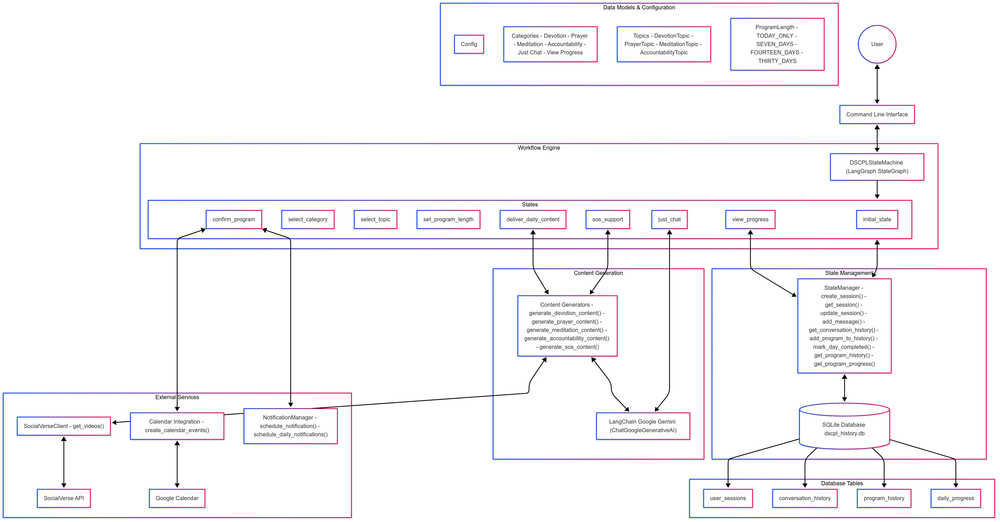

# DSCPL (Daily Spiritual Content & Prayer Life) Assistant

## Project Overview
DSCPL is an AI-powered spiritual assistance platform that combines state management, language models, and external APIs to provide personalized spiritual guidance. The project is built using a modern architecture that leverages LangGraph for workflow management and Google's Gemini Pro for content generation.

## Demo
Watch the project demo: [DSCPL Demo Video](https://drive.google.com/file/d/1Ze55QYGP7Kr_P1cdgxjSioFwl1qHt8ux/view?usp=sharing)

## Calendar Integration
The application integrates with Google Calendar to help you stay on track with your spiritual journey:


## System Architecture


How to Run:
--> ADD GOOGLE API KEY
--> For Calender Notification add credential.json file in directory
-->Create virtual Environment
-->Run python main.py
--> Start Conversation
--> You can exit any time(type end or exit or stop)

## Code Architecture

### 1. Core Components

#### State Management (`main.py`)
The application uses LangGraph's `StateGraph` for managing user interactions and program flow:

```python
class DSCPLStateMachine:
    def __init__(self):
        self.workflow = StateGraph(state_schema=dict)
        
        # Define nodes for different states
        self.workflow.add_node("initial", self.initial_state)
        self.workflow.add_node("select_category", self.select_category)
        self.workflow.add_node("select_topic", self.select_topic)
        # ... other nodes
```

Key State Transitions:
- Initial → Category Selection
- Category Selection → Topic Selection
- Topic Selection → Program Length
- Program Length → Confirmation
- Confirmation → Content Delivery

#### Data Models (`models.py`)

##### Enums for Content Organization
```python
class Category(str, Enum):
    DEVOTION = "Daily Devotion"
    PRAYER = "Daily Prayer"
    MEDITATION = "Daily Meditation"
    ACCOUNTABILITY = "Daily Accountability"
    JUST_CHAT = "Just Chat"
    PROGRESS = "View Progress"

class DevotionTopic(str, Enum):
    STRESS = "Dealing with Stress"
    FEAR = "Overcoming Fear"
    # ... other topics
```

##### Database Schema
The application uses SQLite with four main tables:
1. `user_sessions`: Tracks active user sessions
2. `conversation_history`: Stores chat interactions
3. `program_history`: Records program completion
4. `daily_progress`: Tracks daily achievements

### 2. Key Features Implementation

#### Content Generation
The system uses Google's Gemini Pro model for generating personalized content:

```python
llm = ChatGoogleGenerativeAI(
    model="gemini-1.5-pro",
    temperature=0
)
```

Content types include:
- Daily Devotionals (text/video)
- Prayer Guidance
- Meditation Scripts
- Accountability Support

#### State Management
The `StateManager` class handles session persistence:

```python
class StateManager:
    @staticmethod
    def create_session(user_id: str) -> str:
        # Creates new user session
        pass

    @staticmethod
    def update_session(session_id: str, updates: Dict[str, Any]):
        # Updates session state
        pass
```

#### External Integrations

##### Google Calendar Integration
```python
def create_calendar_events(session_id: str, program_length: int):
    # Creates calendar events for program duration
    pass
```

##### Social Verse API Integration
```python
class SocialVerseClient:
    @staticmethod
    def get_videos(topic: Optional[str] = None, max_results: int = 3):
        # Fetches relevant video content
        pass
```

### 3. Program Flow

1. **Initialization**
   - User session creation
   - State initialization
   - Database setup

2. **Category Selection**
   - User chooses program type
   - State updates
   - Topic selection preparation

3. **Topic Selection**
   - Category-specific topics
   - Content type preference
   - Program customization

4. **Program Configuration**
   - Length selection
   - Time preference
   - Calendar integration

5. **Content Delivery**
   - Daily content generation
   - Progress tracking
   - Notification management

### 4. Technical Implementation Details

#### State Machine Design
The application uses a directed graph for state transitions:
```python
self.workflow.add_conditional_edges(
    "select_category",
    self.decide_after_category,
    {
        "just_chat": "just_chat",
        "needs_topic": "select_topic",
        "needs_length": "set_program_length",
        "view_progress": "view_progress",
        "complete": END
    }
)
```

#### Content Generation Pipeline
1. Topic Analysis
2. Content Type Selection
3. LLM Processing
4. Media Integration
5. Delivery Scheduling

#### Database Operations
```python
def init_db():
    # Creates necessary tables
    conn = sqlite3.connect(Config.DATABASE_NAME)
    cursor = conn.cursor()
    # Table creation SQL
    conn.commit()
    conn.close()
```

### 5. Security Features

1. **Session Management**
   - Unique session IDs
   - State validation
   - Secure storage

2. **API Security**
   - Environment variable protection
   - Token management
   - Rate limiting

3. **Data Protection**
   - SQLite encryption
   - Secure credential storage
   - Input validation

### 6. Error Handling

The application implements comprehensive error handling:
```python
try:
    # Operation
except ValueError:
    # Handle invalid input
except Exception as e:
    # Handle unexpected errors
```

### 7. Performance Optimizations

1. **Database Operations**
   - Connection pooling
   - Prepared statements
   - Index optimization

2. **Content Generation**
   - Caching
   - Batch processing
   - Async operations

3. **State Management**
   - Efficient transitions
   - Memory optimization
   - State persistence

## Code Organization

```
dscpl/
├── main.py              # State machine and workflow
├── models.py            # Data models and business logic
├── requirements.txt     # Dependencies
├── .env                # Environment configuration
├── credentials.json    # API credentials
└── dscpl_history.db    # SQLite database
```

## Key Dependencies
- langgraph: State management
- langchain-google-genai: LLM integration
- google-auth-oauthlib: Google API authentication
- python-dotenv: Environment management
- httpx: HTTP client

## Architecture Diagrams
This file contains:

1. Main.py State Machine Flow
2. Models.py Class Structure
3. Database Schema
4. System Architecture
5. Content Generation Flow
6. Program Lifecycle

These diagrams provide a visual representation of the application's architecture, data flow, and component relationships. 